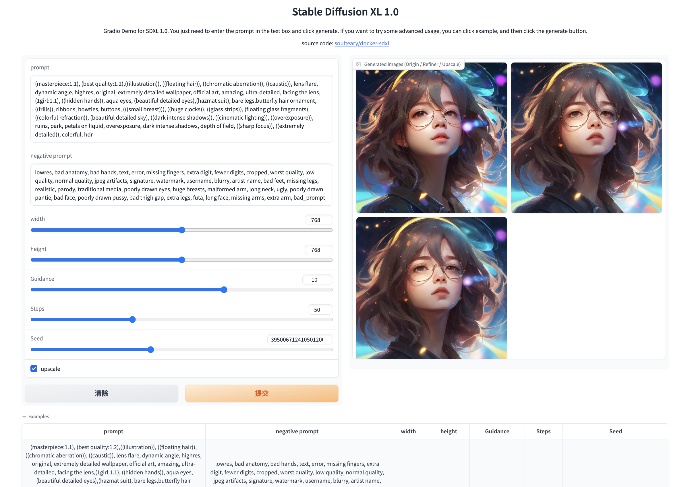

# Docker Stable Diffusion XL (SDXL)

简单、靠谱的 SDXL Docker 使用方案。



## 镜像下载地址

- 百度网盘: TBD
- 迅雷网盘: TBD

## Docker 镜像说明

```bash
# 和官方镜像保持一致的 PyTorch 版本
soulteary/sdxl:runtime
# 包含所有模型的镜像
soulteary/sdxl:all

# xformers 版本，PyTorch 版本较低
soulteary/sdxl:runtime-xformers
# 包含所有模型的镜像
soulteary/sdxl:all-xformers
```

## 额外计划

- 集成 2～3 种主流 UI

## 手动构建

```bash
# 构建基础镜像
bash scripts/make-sdxl-base.sh
# 构建运行时镜像
bash scripts/make-sdxl-runtime.sh

# 将模型下载至 `stabilityai` 目录后
bash scripts/make-sdxl-one-click.sh
```